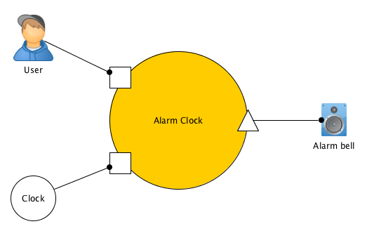
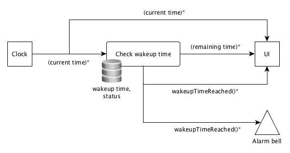
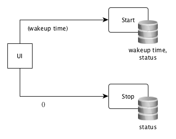

Alarm Clock
===========

Mission
-------

Write an application to work as an alarm clock. It displays the current time and
the user can set a wakeup time. Once the wakeup time is reached the application
sounds an alarm. 

Requirements
------------

When the user switches the alarm on, the remaining time until the wakeup time
will be displayed. Both current time and remaining time will constantly (every
second) be updated.

The user can switch off the count down at any time. The remaining time will then
disappear.

When the wakeup time is reached a WAV or MP3 file should be played by the
application.

Overview
--------

*   System clock tick
    *   Update display of current time
    *   Update display of remaining time while alarm is switched on
    *   Check if wakeup time has been reached
    *   Sound alarm if wakeup time has been reached
    *   Switched off checking for wakeup time if wakeup time has been reached
*   Switch on the alarm
    *   Switch on checking for the wakeup time
*   Switch off the alarm
    *   Switch off checking for the wakeup time

Design
------

### System clock tick

For every tick of the _system clock_ it is checked, if the _wakeup time_ has
been reached. Of course this check is only done while the alarm is switched on
(see _status_).

Also, while the alarm is switched on, the remaining time until the wakeup time
is calculated. Both current time and remaining time flow to the _UI_ and the
_alarm bell_ is rung.

### Switch on/off the alarm

Starting the alarm clock means registering the _wakeup time_ and setting the
_status_ to "active". Stopping it means setting the _status_ to "inactive."
