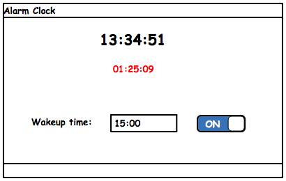

Alarm Clock
===========

Mission
-------

Write an application to work as an alarm clock. It displays the current time and
the user can set a wakeup time. Once the wakeup time is reached the application
sounds an alarm. 

Requirements
------------

When the user switches the alarm on, the remaining time until the wakeup time
will be displayed. Both current time and remaining time will constantly (every
second) be updated.

The user can switch off the count down at any time. The remaining time will then
disappear.

When the wakeup time is reached a WAV or MP3 file should be played by the
application.
